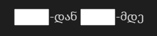
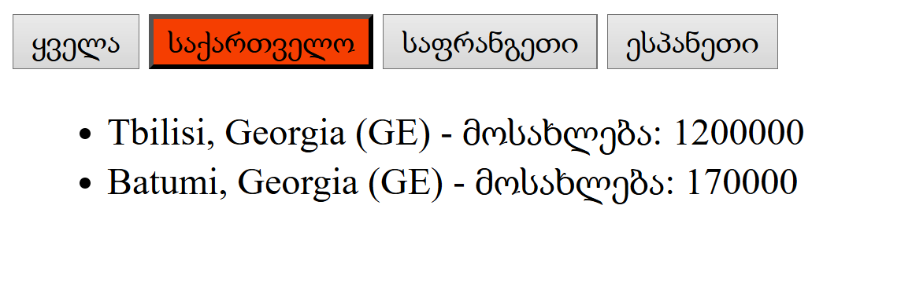

# დავალება 1

**1.1** დაბეჭდეთ სიტყვები რომელთა სიმბოლების რაოდენობა მეტია 5-ზე

- გააკეთეთ ორი გზით:
  - forEach-ით
  - filter-ით

```js
const words = ["apple", "banana", "cherry", "date", "fig"];
```


# დავალება 2


**2.1** დაბეჭდეთ სია HTML ფაილში და გაიფილტროს input-ების დახმარებით
- ასაკი უნდა იყოს ჩაწერილ პირველ ციფრზე მეტი და მეორეზე ნაკლები
- ფილტრი გააკეთოს ღილაკზე დაჭერით
- თუ რომელიმე ველი შევსებული არ იყო გამოიტანოს შეტყობინება "გთხოვთ შეავსოთ ორივე ველი"

<!-- <input style="width: 35px"/>-დან <input style="width: 35px"/>-მდე -->



```js
const persons = [
  {
    name: "nika",
    surname: "shavdia",
    age: 17
  },
  {
    name: "giga",
    surname: "metreveli",
    age: 18
  },
  {
    name: "lasha",
    surname: "gomarteli",
    age: 25
  },
  {
    name: "vano",
    surname: "tabagari",
    age: 28
  }
]
```
# დავალება 3

ღილაკებზე დაჭერით გამოვიდეს შესაბამისი ქალაქების სია (როგორც სურათზე)
- ჩატვირთვის დროს ჩანს ყველა
- გაფილტრვა ხდება მოცემული მასივიდან
- ღილაკზე დაჭერით ფერი ეცვლება აქტიურ ღილაკს



```js
const cities = [
    { name: "Tbilisi", population: 1200000, country: "Georgia", countryCode: "GE" },
    { name: "Batumi", population: 170000, country: "Georgia", countryCode: "GE" },
    { name: "Paris", population: 2160000, country: "France", countryCode: "FR" },
    { name: "Lyon", population: 522000, country: "France", countryCode: "FR" },
    { name: "Madrid", population: 3280000, country: "Spain", countryCode: "ES" },
    { name: "Barcelona", population: 1620000, country: "Spain", countryCode: "ES" }
];
```