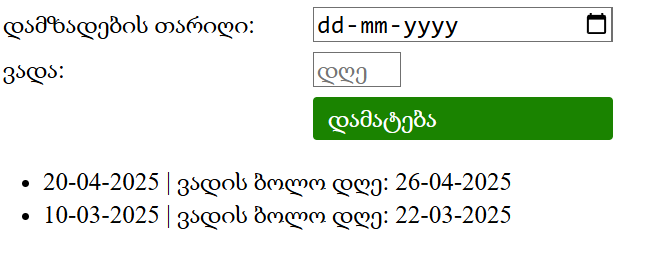

### [დოკუმენტაცია](EXPLAIN.md) 

# დავალება 1

- პირველ ინფუთში ირჩევთ დამზადების თარიღს
- მეორე ინფუთში წერთ რიცხვს რამდენი დღე აქვს ვადა
- ქვემოთ სიაში წერს დამზადების თარიღს და ასევე თქვენს მიერ დაანგარიშებულ ვადის გასვლის თარიღს