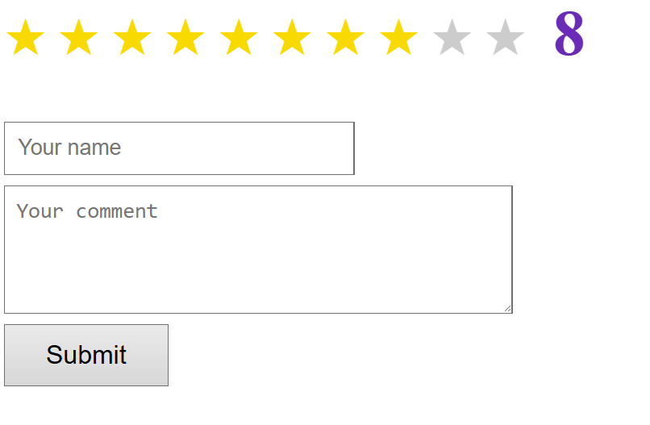

# დავალება 1

დაბეჭდეთ კომენტარები პოსტების აიდების მიხედვით: 

`https://koleji.coding-world.com/mvs/comments?post_id={post_id}`  

- თარიღის ფორმატის მაგალითი: `2 ინავარი 2025წ. 22:00`

ასევე დაამატეთ კომენტარები პოსტების აიდების მიხედვით:  

`https://koleji.coding-world.com/mvs/comments/add.php`  

გაატანეთ მსგავსი ობიექტი:
```js
{
    post_id: Number,
    author: String,
    comment: String
}

```

### ასევე დაამატეთ ვარსკვლავებით შეფასება

- მაგ. თუ დააჭერთ მე-8 ვარსკვლავს, უნდა მოინიშნოს პირველიდან 8-ის ჩათვლით და გვერდით ციფრი დაეწეროს 8



- გასაგზავნ ობიექტს დაამატებთ მსგავს ქეის: `{ rating: Number }`
- `rating` ქეის მიიღებთ და გამოაჩენთ კომენტარებთან ერთად  მაგ. მსგავსი სახით: `8/10`
