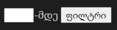

# დავალება 1

**1.1** ```prompt()```-ის დახმარებით შეიყვანეთ 2 ნიშნა რიცხვი და დაბეჭდეთ ცალ-ცალკე
> მაგ. თუ ჩაწერთ **`45`**-ს დაბეჭდოს **`4 5`**

**1.2** მოცემული წინადადებიდან ყველა სიტყვა დაბეჭდეთ ცალ-ცალკე ხაზზე *(**for-ის** დახმარებით)*
```js
  let desc = "HTML ჰიპერტექსტური მარკირების ენა"
```

# დავალება 2
> გამოიყენეთ ***for*** ოპერატორი

**2.1** დათვალეთ რამდენჯერ მეორდება ციფრი 4 მასივში

```js
const numbers = [ 4, 8, 3, 4, 7, 9, 3, 7, 4 ]
```
**2.2**  დაბეჭდეთ ყოველი მეორე ციფრი მასივიდან

**2.3**  დაბეჭდეთ მხოლოდ კენტი რიცხვები

# დავალება 3
> გამოიყენეთ ***for*** ოპერატორი

დაბეჭდეთ სია HTML ფაილში და გაიფილტროს input-ის დახმარებით
- ასაკი უნდა იყოს ჩაწერილ ციფრზე ნაკლები



```js
const persons = [
  {
    name: "nika",
    surname: "shavdia",
    age: 17
  },
  {
    name: "giga",
    surname: "metreveli",
    age: 18
  },
  {
    name: "lasha",
    surname: "gomarteli",
    age: 25
  },
  {
    name: "vano",
    surname: "tabagari",
    age: 28
  }
]
```
